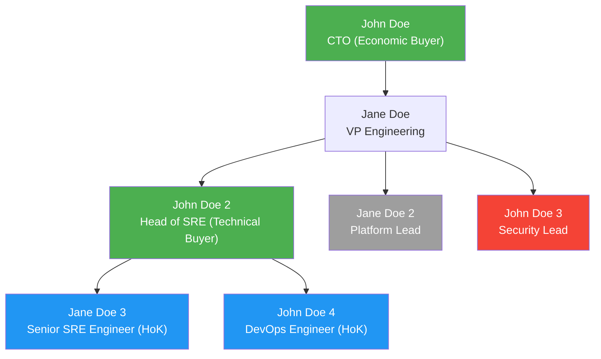
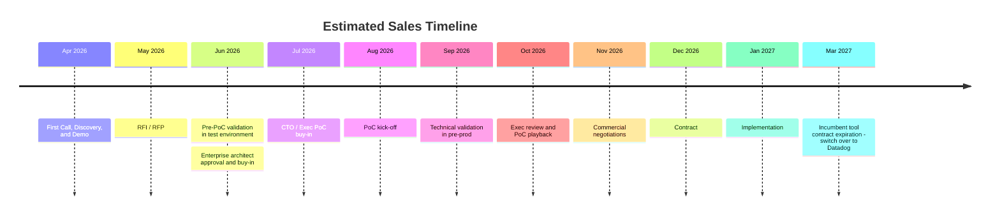
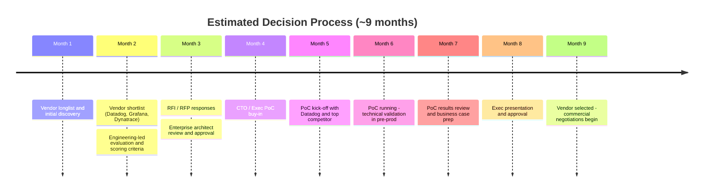

# Datadog Lead Qualification Template

> **Instructions:**
> - If a point is mentioned in the input, quote it directly using "..."
> - Do NOT hallucinate, assume, or infer anything that was not explicitly mentioned
> - If a point is not covered in the input, do not fill it in — flag it as a suggested question to frame for the discovery call

## BANT

### Budget

* Budget / current spend: [Quote directly if mentioned. Do not assume — frame for discovery call if not mentioned]
* Approval path: [Quote directly if mentioned. Do not assume — frame for discovery call if not mentioned]

**Examples**

* "$200K+ across Splunk + New Relic -> looking to consolidate"
* "No fixed budget yet; needs ROI case for FY planning"
* "~$120K/year on Elastic + custom tooling -> looking to rationalize spend"
* "Budget approved for platform engineering improvements, ~$300K range"
* "Currently under cloud budget pressure -> needs cost-neutral or savings-driven solution"
* "Exploring a replacement for in-house observability -> budget flexible if headcount savings justified"

### Authority

* Economic buyer: [Quote directly if mentioned. Do not assume — frame for discovery call if not mentioned]
* Technical buyer / champion: [Quote directly if mentioned. Do not assume — frame for discovery call if not mentioned]
* Champions (pro-Datadog): [Quote directly if mentioned. Do not assume — frame for discovery call if not mentioned]
* Neutral: [Quote directly if mentioned. Do not assume — frame for discovery call if not mentioned]
* Detractors (preferred vendor): [Quote directly if mentioned. Do not assume — frame for discovery call if not mentioned]
* Hands-on-Key (HoK): [Quote directly if mentioned. Do not assume — frame for discovery call if not mentioned]
* Org chart (mermaid, annotate each person as champion / neutral / detractor / HoK): [Quote directly if mentioned. Do not assume — frame for discovery call if not mentioned]

**Examples**

* "John Doe (CTO) owns budget; Jane Doe (Head of SRE) leading eval"
* "John Doe (VP Eng) approves; Jane Doe (Platform Lead) driving POC"
* "Jane Doe (Head of Platform) is key decision-maker; John Doe (CTO) signs off on final contract"
* "John Doe (Director of DevOps) owns tooling decisions; Jane Doe (Finance) involved for approval"
* "Jane Doe (Security Lead) influences decision due to compliance requirements"
* "John Doe (Engineering Lead) aligned, but Jane Doe (Procurement) requires vendor comparison"

**Examples of mermaid chart for Authority**

> Champion (green): John Doe (CTO), John Doe 2 (Head of SRE) — actively pushing for Datadog
> Neutral (grey): Jane Doe 2 (Platform Lead) — open, no strong preference
> Detractor (red): John Doe 3 (Security Lead) — prefers Splunk for SIEM integration
> Hands-on-Key / HoK (blue): Jane Doe 3, John Doe 4 — doing the POC validation work

### Need

* Core pain: [Quote directly if mentioned. Do not assume — frame for discovery call if not mentioned]
* Business impact: [Quote directly if mentioned. Do not assume — frame for discovery call if not mentioned]

**Examples**

* "Tool sprawl -> slow MTTR (2+ hrs)"
* "No visibility across K8s + microservices -> frequent outages"
* "Alert fatigue -> too many false positives, hard to prioritize incidents"
* "Lack of correlation between logs and traces -> slow debugging"
* "Scaling issues with current monitoring as they move to microservices"
* "Manual incident response -> no automation or workflow integration"

### Timeline

* Target decision: [Quote directly if mentioned. Do not assume — frame for discovery call if not mentioned]
* Trigger: [Quote directly if mentioned. Do not assume — frame for discovery call if not mentioned]
* Incumbent Tool Contract Expiration/Renewal: [Quote directly if mentioned. Do not assume — frame for discovery call if not mentioned]

**Examples**

* "POC this month, decision next quarter"
* "Budget planned for and used by end of the year."
* "Aligned with cloud migration in FY"
* "Need solution before peak season (e.g., Black Friday)"
* "Decision tied to renewal of current vendor in 60 days"
* "Pilot now -> rollout next FY depending on results"
* "Urgent due to recent incidents -> evaluating immediately"
* "No urgency. Not a management priority yet."
* "Dynatrace contract expires in May 2027. Currently on annual contract."
* "New Relic contract expires in Mar 2026 and they plan to use New Relic month by month while evaluating other observability tools."
* "Splunk renewal is Mar 2027."

**Examples of mermaid chart for Timeline**

> Adjust dates and phases based on what was mentioned in the conversation.

> It is very important to find out when the incumbent contract expires, as well as who owns the contract - is it the technical buyer or their outsourced partner?

---

## MEDDICC

### Metrics

* Success criteria: [Quote directly if mentioned. Do not assume — frame for discovery call if not mentioned]

**Examples**

* "MTTR: 2h -> <30 mins"
* "Reduce observability cost by 25%"
* "Improve deployment frequency by 2x (DevOps KPI)"
* "Reduce alert noise by 40%"
* "Cut incident investigation time from 6 hours to 45 minutes"
* "Increase service uptime from 99.5% -> 99.9%"

### Economic Buyer

* Who + priority: [Quote directly if mentioned. Do not assume — frame for discovery call if not mentioned]
* Champions (pro-Datadog): [Quote directly if mentioned. Do not assume — frame for discovery call if not mentioned]
* Neutral: [Quote directly if mentioned. Do not assume — frame for discovery call if not mentioned]
* Detractors (preferred vendor): [Quote directly if mentioned. Do not assume — frame for discovery call if not mentioned]
* Hands-on-Key (HoK): [Quote directly if mentioned. Do not assume — frame for discovery call if not mentioned]
* Org chart (mermaid, annotate each person as champion / neutral / detractor / HoK): [Quote directly if mentioned. Do not assume — frame for discovery call if not mentioned]

**Examples**

* "John Doe (CTO) -> reduce downtime cost"
* "Jane Doe (CFO) -> optimize cloud + tool spend"
* "John Doe 2 (Head of Digital) -> improve customer experience"
* "Jane Doe 2 (VP Platform) -> increase engineering velocity"
* "John Doe 3 (CIO) -> standardize tooling across org"
* "Jane Doe 3 (Head of Security) -> reduce risk + improve compliance posture"

**Examples of mermaid chart for Economic Buyer**

> Champion (green): John Doe (CTO), John Doe 2 (Head of SRE) — actively pushing for Datadog
> Neutral (grey): Jane Doe 2 (Platform Lead) — open, no strong preference
> Detractor (red): John Doe 3 (Security Lead) — prefers Splunk for SIEM integration
> Hands-on-Key / HoK (blue): Jane Doe 3, John Doe 4 — doing the POC validation work

### Decision Criteria

* Key requirements: [Quote directly if mentioned. Do not assume — frame for discovery call if not mentioned]
* Do the requirements align with Datadog's strengths like unified telemetry and platform play? [Quote directly if mentioned. Do not assume — frame for discovery call if not mentioned]

**Examples**

* "Unified platform (logs + APM + infra)"
* "Low maintenance + strong K8s support"
* "Strong support for multi-cloud (AWS + GCP)"
* "Real-time visibility with high granularity metrics"
* "Ability to ingest all data but control costs (logs/metrics flexibility)"
* "AI-driven insights / anomaly detection"

### Decision Process

* Steps + vendors: [Quote directly if mentioned. Do not assume — frame for discovery call if not mentioned]

**Examples**

* "Datadog vs Grafana vs Dynatrace (2-week POC)"
* "Shortlist -> POC -> exec review"
* "Engineering-led evaluation -> business case -> exec approval"
* "Run POC -> validate MTTR improvement -> expand scope"
* "Security + DevOps joint evaluation before shortlist"
* "Renewal-driven: must justify replacing existing vendor"
* "Need to request for budget from the board at the next board meeting in Oct 2026."

**Examples of mermaid chart for Decision Process**

> Adjust steps and vendors based on what was mentioned in the conversation.

### Identify Pain

* Technical + business pain: [Quote directly if mentioned. Do not assume — frame for discovery call if not mentioned]

**Examples**

* "Engineers firefighting instead of building"
* "Outages impacting revenue + customer experience"
* "Too many tools -> context switching during incidents"
* "No ownership visibility -> unclear who owns services"
* "Difficult to onboard new engineers due to fragmented tooling"
* "Reactive monitoring -> issues detected after customer impact"

### Champion

* Internal advocate: [Quote directly if mentioned. Do not assume — frame for discovery call if not mentioned]

**Examples**

* "Staff SRE (used Datadog before)"
* "Platform Lead pushing for consolidation with Datadog because they find Datadog the most suitable."
* "Senior DevOps engineer frustrated with current tools and likes that Datadog is a leader in the Gartner Magic Quadrant."
* "New VP Engineering pushing modernization initiative and has used Datadog at their previous company"
* "Cloud architect advocating for unified observability on Datadog as the platform offers LLM observability together with APM down to GPU monitoring."
* "Security lead interested in consolidating SIEM + observability as Datadog offers truly unified security and observability on a single platform."

### Competition

* Current + evaluated tools: [Quote directly if mentioned. Do not assume — frame for discovery call if not mentioned]

**Examples**

* "New Relic + Splunk today"
* "Evaluating Grafana Cloud for cost reasons"
* "Using Prometheus + Grafana (DIY stack)"
* "Splunk for logs, Datadog being evaluated for full-stack"
* "Dynatrace + Splunk"

---

## 3 WHYS

### Why Datadog?

Tie to reasons for preferring Datadog over others: [Quote directly if mentioned. Do not assume — frame for discovery call if not mentioned]

**Examples**

* "Currently using Datadog for infrastructure monitoring -> want to consider APM now"
* "Single platform -> faster root cause (metrics + logs + traces)"
* "Already using Datadog APM -> want full-stack observability for LLM"
* "Better developer experience including documentation vs current tools"
* "Recommended by several engineers"

### Why Now?

Tie to FY initiatives: [Quote directly if mentioned. Do not assume — frame for discovery call if not mentioned]

**Examples**

* "Kubernetes rollout this FY -> need visibility"
* "Migrating to containers this FY -> need visibility"
* "FinOps initiative -> reduce tooling + cloud costs"
* "Recent reorg -> platform team centralizing tooling"
* "Launching new digital product -> need reliability"
* "Adopting AI/LLM workloads -> need new observability capabilities"

### Why Do Anything?

Tie to urgency / risk: [Quote directly if mentioned. Do not assume — frame for discovery call if not mentioned]

**Examples**

* "Recent outage cost $300K -> exec priority"
* "Developer productivity blocked by debugging time"
* "Incidents causing SLA breaches"
* "Want to improve quality of service"
* "Rising cloud + observability costs becoming unsustainable"
* "Splunk is expensive -> management wants to explore alternatives"
* "Dynatrace is expensive -> management wants to explore alternatives"

---

> **Reminder — Instructions:**
> - If a point is mentioned in the input, quote it directly using "..."
> - Do NOT hallucinate, assume, or infer anything that was not explicitly mentioned
> - If a point is not covered in the input, do not fill it in — flag it as a suggested question to frame for the discovery call
